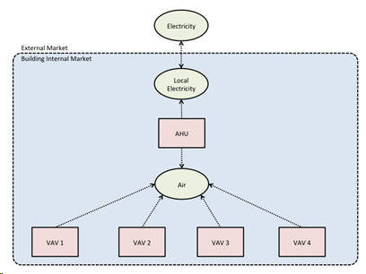

# AHU Agent

The AHU Transactive control and coordination (TCC) agent interacts with the VOLTTRON market service
as a consumer of electricity and as a supplier of cooling air to VAV TCC agent(s).  For information on the VOLTTRON
Market Service see:

https://volttron.readthedocs.io/en/develop/developing-volttron/developing-agents/developing-market-agents.html#developing-market-agents

The following Schematic of a transactive market with agents depicted as red rectangles and markets depicted as green ovals is a simple example
that shows the relationship between the AHU agent, VAV agent, and VOLTTRON market service (labeled Building internal market).
In a real building deployment the building could have many AHUs, each serving different VAVs, as well as other devices bidding into the electric market (e.g., lighting).




## AHU Agent Configuration

You can specify the configuration in either json or yaml format. The json format is specified below:

* Agent config file:

````
{
    "campus": "CAMPUS", # if omitted defaults to ""
    "building": "BUILDING", # if omitted defaults to ""
    "input_data_timezone": "UTC", # if omitted defaults to "UTC"
    "supplier_market_name": "air1",
	"consumer_market_name": "electric",
    "market_type": "rtp",
    "agent_name": "ahu1",
    "inputs": [
        {
            "mapped": "sfs", # mapped value does not change
            "point": "SupplyFanStatus",
            "topic": "devices/CAMPUS/BUILDING/AHU1/all",
            "inital_value": 0
        },
        {
            "mapped": "oat",
            "point": "OutdoorAirTemperature",
            "topic": "devices/CAMPUS/BUILDING/AHU1/all",
            "inital_value": 21.1
        },
        {
            "mapped": "mat",
            "point": "MixedAirTemperature",
            "topic": "devices/CAMPUS/BUILDING/AHU1/all",
            "inital_value": 21.1
        },
        {
            "mapped": "dat",
            "point": "DischargeAirTemperature",
            "topic": "devices/CAMPUS/BUILDING/AHU1/all",
            "inital_value": 13.8
        },
        {
            "mapped": "saf",
            "point": "SupplyAirFlow",
            "topic": "devices/CAMPUS/BUILDING/AHU1/all",
            "inital_value": 0.0
        }
    ],
    "outputs": [],
    "schedule":{},
    "model_parameters": {
        "equipment_configuration": {
            "has_economizer": true,
            "economizer_limit": 18.33,
            "supply_air_sepoint": 13.0,
            "nomina_zone_setpoint": 21.1,
            "building_chiller": true
        },
        "model_configuration": {
            "c0": 0.0024916812889370643,
            "c1": 0.53244827213615642,
            "c2": -0.15144710994850016,
            "c3": 0.060900887939007789,
            "cpAir": 1.006, #kj/kgK for calculation of kW
            "COP" : 5.5 
        }
    }
}
````

User can create a config file using the tcc-config-web-tool: https://tcc-configuration-tool.web.app/
and follow instructions from the tcc-userguide https://tcc-userguide.readthedocs.io/en/latest/

## Install and activate VOLTTRON environment
For installing, starting, and activating the VOLTTRON environment, refer to the following VOLTTRON readthedocs: 
https://volttron.readthedocs.io/en/develop/introduction/platform-install.html

## Installing and Running AHU Agent
Install and start the AHU Agent using the script install-agent.py as describe below:

```
python VOLTTRON_ROOT/scripts/install-agent.py -s <top most folder of the agent> 
                                -c <Agent config file>
                                -i agent.AHU
                                -t AHU
                                --start --force
```
, where VOLTTRON_ROOT is the root of the source directory of VOLTTRON.

-s : followed by path of top most folder of the AHU agent

-c : followed by path of the agent config file

-i : followed by agent identity

-t : followed by name tag
 
--start (optional): start after installation

--force (optional): overwrites existing ilc agent with identity "agent.AHU" 

